## 실행가능한 jar 생성.

(1) IntelliJ IDEA > File > Project Structure...(cmd + ;) 

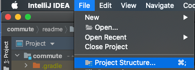

(2) Artifacts > + > JAR > From modules with dependencies... 

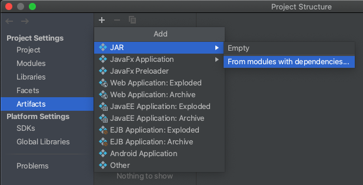

(3) 폴더모양 클릭

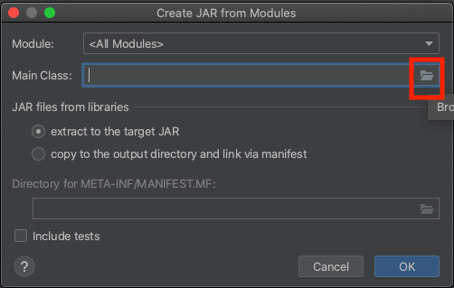

(4) 실행될 Main Application 선택(CommuteApplication)

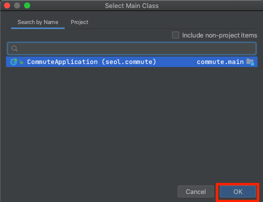

(5) OK 클릭

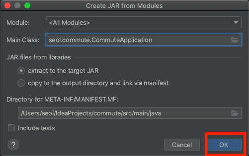

(6) 만약 Error가 뜨면, /src/main/java/META-INF/MANIFEST.MF 삭제 후 재시도. 

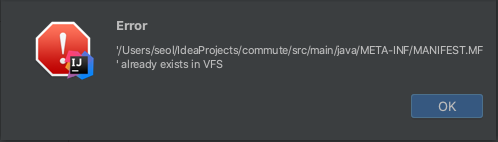

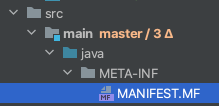

(7) Output Directory 지정
    - 프로젝트에 디렉토리 만들어서 포함시키거나, 특정 디렉토리 생성.
    

(8) +버튼 클릭 > Module Source > Commute.main 선택 > OK 클릭

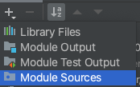

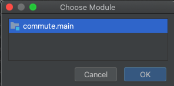

(9) 'commute.main' sources가 추가되었다면 OK 클릭 후 설정을 완료한다.

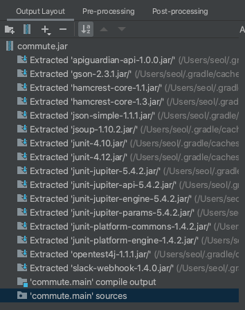

(10) Build > Build Artifacts  

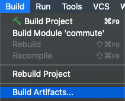

(11) commute:jar > Build 

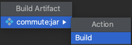

(12) 7번에서 지정한 경로에 commute.jar이 생겼다면 성공.
- 추후 application.properties 변경시 재생성 필요.

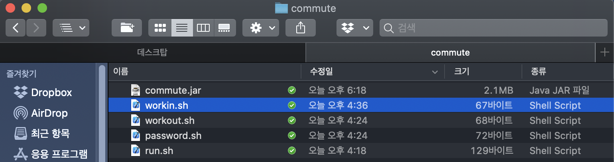