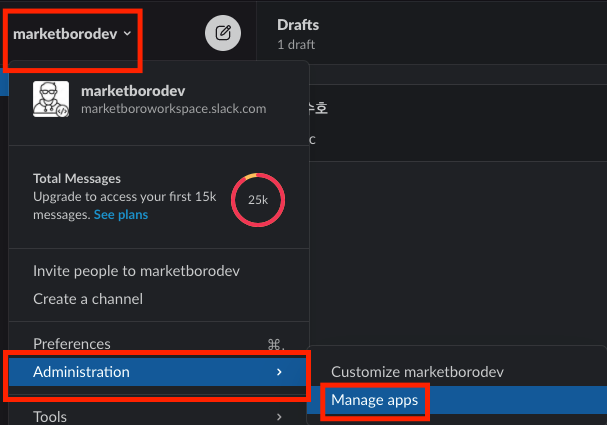
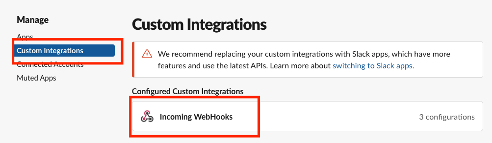
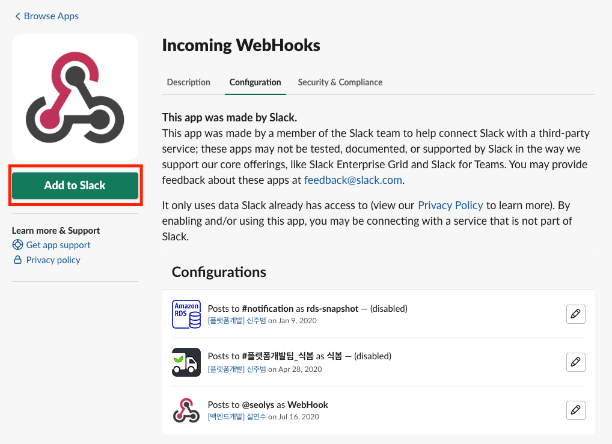
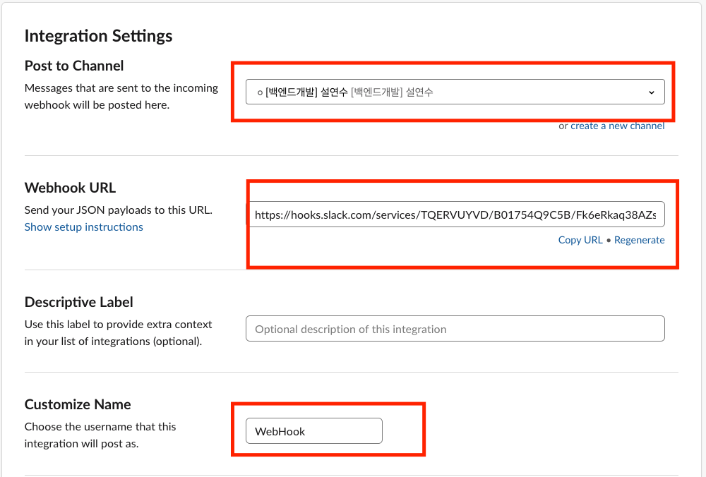

## Slack WebHook

(1) Slack > 설정 > Administration > Manage apps

(2) Manage > Custom Integrations > Incoming WebHooks

(3) Add to Slack
- 이미 만들어져있는거 참고하여 생성.

(4) 아래 표시된 채널명, WebHookURL, Name이 필요함.

