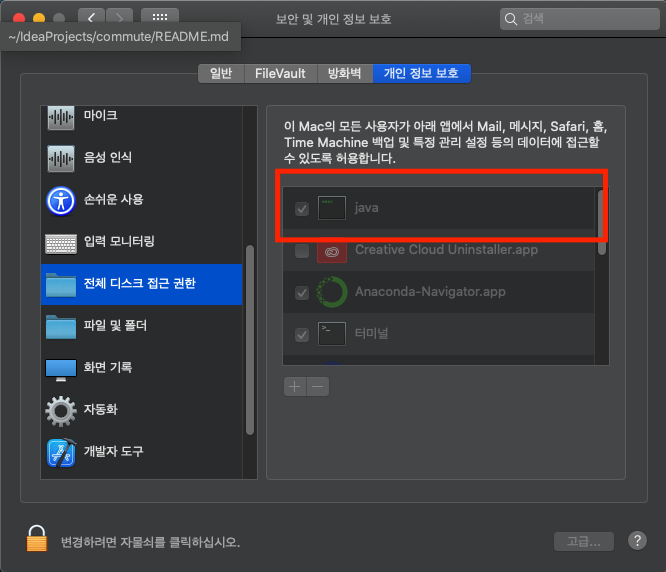

## crontab

(1) crontab을 걸기전에 실행이 잘되는지 먼저 테스트한다.
```
sh workout.sh

Slack 메시지가 전송되고, 브라우저로 그룹웨어가 뜨면 성공.
```
```
sh workin.sh

로그를 보고 성공했는지 판단.
crontab -l (또는 crontab -e)명령어를 통해 workout.sh Job이 생성되었는지 확인한다.
Job생성이 안되었으면 설정 실패.(2번단계 설정문제인지 확인. 성공했어도 2번단계 진행해야함)
```

(2) 시스템환경설정 > 보안 및 개인 정보 보호 > 개인 정보 보호 탭 클릭 > 전체 디스크 접근 권한 > java체크



(3) crontab 설정(테스트용)
- 터미널에서 성공했어도 crontab이 실행하는환경은 또 다르기때문에 실행 후 결과를 확인한다.
- 테스트를 위해 매분 돌아갈 수 있도록 한다.
- 실패시 디버그하기위해 log를 설정한다.
```
crontab -e
```
```
* * * * * sh /Users/seol/Dropbox/marketboro/commute/workin.sh >> /Users/seol/Dropbox/marketboro/commute/cron.log 2>&1
```

(4) workin이 성공했다면 workout도 테스트
```
crontab -e
```
```
* * * * * sh /Users/seol/Dropbox/marketboro/commute/workout.sh >> /Users/seol/Dropbox/marketboro/commute/cron.log 2>&1
```

(5) workin, workout이 잘되는것을 확인했다면 crontab 시간 설정
- workin.sh만 설정하면 된다.
    - workin.sh이 실행되면서, 기존의 workout.sh Job을 지운 후 퇴근시간에 맞게 재생성한다.
    - 그렇기때문에 11시, 16시 두번돌아도 퇴근시간에 맞는 Job 1개만 유지된다.
- 1-5를 통해 평일에만 실행될 수 있도록 한다.
- debug가 필요하지않다면 cron.log에 불필요 로그가 쌓이지않도록 한다.
```
crontab -e
```
```
0 11,16 * * 1-5 sh /Users/seol/Dropbox/marketboro/commute/workin.sh
```